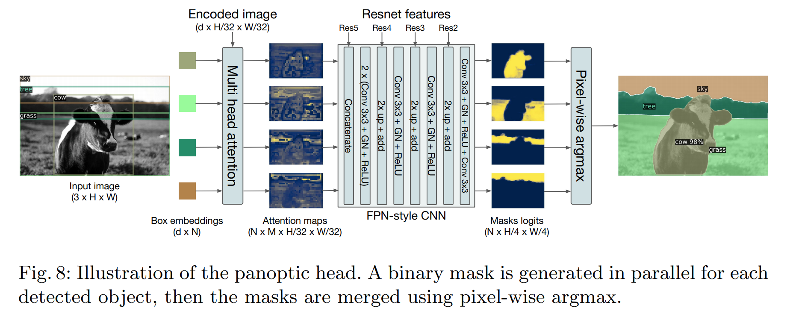
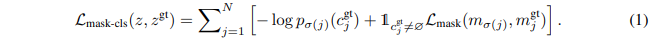
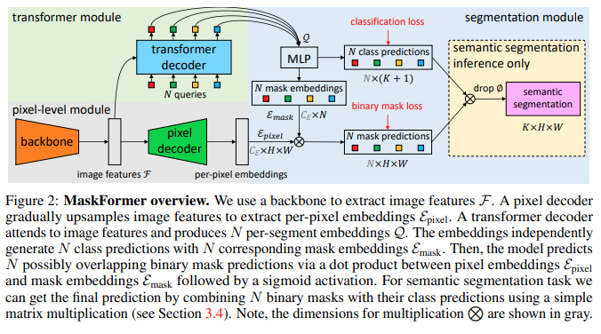

# Per-Pixel Classification is Not All You Need for Semantic Segmentation

### Simple Summary
1. Per-Pixel Classification 을 사용하지 않고 Mask Classification 으로도 Semantic Segmentation 문제에서 높은 성능을 보여주었음.

2. Backbone 으로부터 얻은 Per-Pixel Embedding Vector 와 Transformer 기반의
Object Detection 모델 DETR 의 Decoder 결과를 통해 얻은 Mask Embedding, Class Prediction를 이용하여 Classification Loss와 Binary 
Mask Loss 를 구하고자 함.

## Introduction
제안된 FCN 모델들 대다수는 Per-Pixel Classification 을 이용하여 Semantic Segmentation 에서 강세를 보여주고 있다.
하지만, Regions, Segments 값을 구할 수 없기 때문에 Instance Segmentation 를 해결 할 수 없었다.
Mask Classification 은 단일 클래스에 대한 Binary Mask 의 모음(set)을 예측하기 때문에 Instance Segmentation 문제를 해결하는데 적합하면서,
Mask R-CNN, DETR 모델은 Instance Segmentation 과 Semantic Segmentation 을 동시에 해야 하는 Panoptic Segmentation 도 해결 할 수
있었다. 

#### DETR를 이용한 Panoptic Segmentation 예시

논문의 저자는 DETR 의 성공적인 실험 결과와 Per-Pixel Classification을 이용한 모델들이 등장하기 전부터 Mask Classification 을 이용했던 
O2P, SDS 모델들을 보고, (1) 단일 Mask Classification 모델을 이용하여 Semantic/Instance 문제를 해결 할 수 있는지? 
(2) 기존 Semantic Segmentation 모델들 보다 좋은 성능을 보여줄 수 있는지를 알아보고자 했다.

본 논문에서 제안한 **MaskFormer** 모델은 DETR 모델의 bipartite matching set prediction mechanism 을 이용해 문제에 접근한다.
모델 구조에 대한 상세 설명은 아래에서 설명하겠다.

## Related Works

본인이 생각하는 선행 논문으로는 **DETR** 논문이 적합하다고 생각했다. 

>*모르면 해당 논문의 50%도 얻어가지 못할 것 같다..*

## Formulation

Per-Pixel Classification 와 Mask Classification 에서 Loss 를 구하는 수식이 있고, 간단하게 수식간의 차이를 설명하였다.

위 수식 처럼 binary mask loss 와 classification loss 를 CE 로 Loss 를 구한다.

## MaskFormer

#### MaskFormer Overview

MaskFormer 는 3가지 모듈로 이루어져 있다.

###### 1. pixel-level module

backbone 으로부터 얻은 low-resolution Feature Map은 **transformer module**로 보내면서,

pixel decoder 네트워크로 다시 upsampling 하면서 모든 픽셀에 대한 정보를 학습한 **per-pixel embedding** 을 만든다.

>*local feature를 학습하기 위해 multi-scale을 고려하여 사용한게 아닐까?*
> 
>*후속 논문 Mask2Former는 해당 decoder의 upsampling 과정을 이용하여 multi-scale을 고려한 transformer 모델 학습과정에 좀 더 힘을 쏟게 된다.*

###### 2. transformer module

DETR 모델의 Decoder 부분만 가져왔다.

pixel-level module 의 image feature 를 입력으로 받고 learnable positional encoding 된 queries 를 Decoder의 입력으로 사용한다.

>*DETR 에서 다루는 이야기지만, Image 에서 positional encoding (PE)는 queries 들이 parallel 로 구현 되기 때문에 중요하다고 한 것 같다.*

###### 3. segmentation module

#### loss 를 구하는 과정

transformer module의 결과를 embedding 한 뒤에 softmax 로 K+1 에 대한 Class Classification 로 **(1) classification prediction** 를 얻는 동시에, 2 hidden layer로 이루어진 MLP에도 넣어서 **mask embeddings**를 만들어준다.

앞서, pixel-level module 로부터 얻은 **per-pixel embedding**과 **mask embedding** 을 dot-product 하여 sigmoid 함수를 통해 **(2) binary mask prediction** 를 얻는다.

두 prediction 값은 Formulation 에 나온 수식에 의해 전체 Loss 를 구한다.

>*본 논문에서도 언급하지만 mask loss는 DETR에서 그대로 가져온 focal loss, dice loss 를 사용했다고 한다.*

#### Inference 과정

추가 예정
